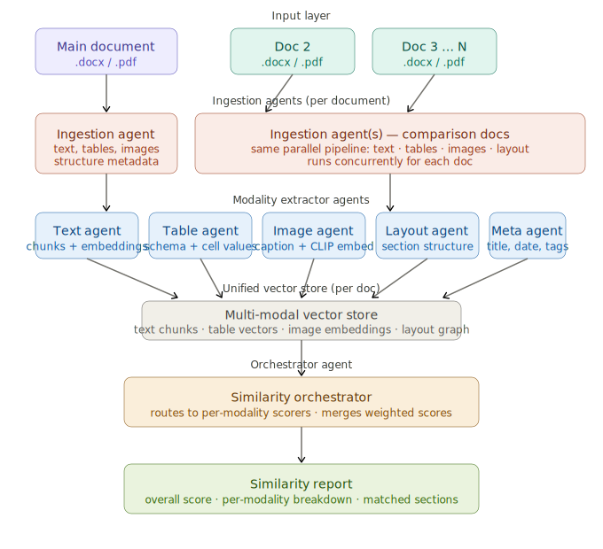

# agentic-multimodal-doc-comparator

An agentic system to accurately match document similarity of two docs containing complex design



## Features (Phase 1)

- **Multi-modal document analysis**: Text and table extraction
- **Semantic similarity**: Uses sentence-transformers for embeddings
- **Interactive Streamlit UI**: Easy-to-use web interface
- **Support for PDF and DOCX**: Compare documents in multiple formats
- **Detailed similarity reports**: Per-modality breakdown and matched sections
- **Configurable weights**: Adjust importance of text vs. tables

## System Architecture

The system implements a 6-layer architecture:

1. **Input Layer**: Accepts PDF/DOCX documents
2. **Ingestion Layer**: Extracts raw content (text, tables)
3. **Modality Extractors**: Specialized agents for text and table processing
4. **Vector Store**: FAISS-based similarity search
5. **Orchestrator**: Coordinates comparison and aggregates scores
6. **Output Layer**: Similarity report with visualizations

## Installation

### Prerequisites

- Python 3.8+
- pip

### Setup

1. Clone the repository:
```bash
git clone <repository-url>
cd agentic-multimodal-doc-comparator
```

2. Install dependencies:
```bash
pip install -r requirements.txt
```

3. (Optional) Set up environment variables:
```bash
cp .env.example .env
# Edit .env with your API keys (for Phase 2 features)
```

## Usage

### Running the Streamlit App

```bash
streamlit run streamlit_app.py
```

The app will open in your browser at `http://localhost:8501`

### Using the App

1. **Upload Documents**: Upload two documents (PDF or DOCX) in the designated areas
2. **Adjust Weights**: Use the sidebar to adjust the weight given to text vs. table comparison
3. **Compare**: Click the "Compare Documents" button
4. **View Results**:
   - Overall similarity score (0-100%)
   - Per-modality breakdown (text and table scores)
   - Top matched sections from both documents
5. **Download Report**: Export results as JSON for further analysis

## Project Structure

```
agentic-multimodal-doc-comparator/
├── agents/                     # Modality extraction agents
│   ├── base_agent.py          # Abstract base class
│   ├── ingestion_agent.py     # PDF/DOCX parsing
│   ├── text_agent.py          # Text chunking & embeddings
│   └── table_agent.py         # Table extraction & embeddings
├── orchestrator/               # Similarity orchestration
│   ├── scorers.py             # Per-modality scoring
│   └── similarity_orchestrator.py  # Main orchestrator
├── storage/                    # Vector storage
│   └── vector_store.py        # FAISS wrapper
├── models/                     # Data models
│   ├── document.py            # Document structures
│   └── similarity.py          # Similarity report structures
├── utils/                      # Utilities
│   ├── file_handler.py        # File upload/validation
│   └── visualization.py       # Result visualization
├── config.py                   # Configuration
├── streamlit_app.py           # Main Streamlit UI
└── requirements.txt           # Dependencies
```

## Configuration

Edit `config.py` to customize:

- **Embedding model**: Default is `all-MiniLM-L6-v2`
- **Chunk size**: Default 512 tokens with 50-token overlap
- **Modality weights**: Default 60% text, 40% tables
- **File limits**: Default 50MB max file size

## Phase 2 Roadmap

Future enhancements include:

- **Image Agent**: Extract and compare images using CLIP embeddings
- **Layout Agent**: Analyze document structure and section hierarchy
- **Meta Agent**: Compare metadata (title, author, date, keywords)
- **Batch Comparison**: Compare 1 document against N documents
- **Enhanced UI**: Visual diff, interactive navigation, filtering

## Technical Details

### Models & Libraries

- **Embedding**: sentence-transformers (all-MiniLM-L6-v2, 384 dimensions)
- **PDF Parsing**: PyMuPDF (text) + pdfplumber (tables)
- **DOCX Parsing**: python-docx
- **Vector Search**: FAISS (cosine similarity)
- **UI**: Streamlit with Plotly visualizations

### Similarity Scoring

- **Text**: Cosine similarity between chunk embeddings, averaged over best matches
- **Tables**: Schema and content similarity using linearized table embeddings
- **Overall**: Weighted combination of modality scores

## Troubleshooting

### Common Issues

1. **"Module not found" errors**: Run `pip install -r requirements.txt`
2. **Large files timing out**: Reduce document size or increase timeout in config
3. **Memory errors**: Process smaller documents or reduce chunk overlap
4. **No matches found**: Documents may be too dissimilar or use different terminology

## Contributing

Contributions welcome! Please:

1. Fork the repository
2. Create a feature branch
3. Make your changes
4. Submit a pull request

## License

MIT License

## Acknowledgments

- Architecture inspired by multi-agent RAG systems
- Built with Streamlit, sentence-transformers, and FAISS
