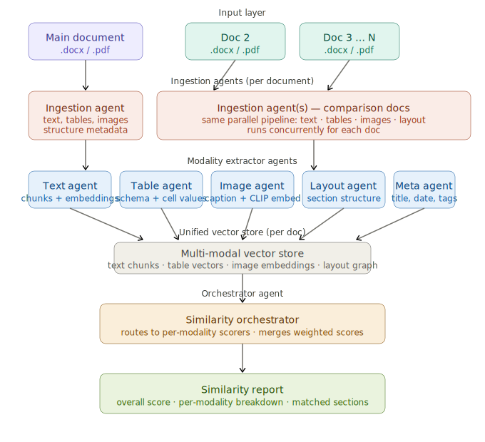

# agentic-multimodal-doc-comparator

An agentic system to accurately match document similarity of two docs containing complex design



## Features (Phase 2 - Complete)

- **Multi-modal document analysis**: Text, tables, images, layout, and metadata extraction
- **Vision-based image comparison**: Uses CLIP embeddings for semantic image similarity
- **Document structure analysis**: Hierarchical section detection and layout comparison
- **Metadata comparison**: Title, author, keywords, dates, and custom properties
- **Semantic similarity**: Uses sentence-transformers for text embeddings
- **Interactive Streamlit UI**: Easy-to-use web interface
- **Support for PDF and DOCX**: Compare documents in multiple formats
- **Detailed similarity reports**: Per-modality breakdown and matched sections
- **Configurable weights**: Adjust importance across all modalities
- **Batch comparison**: Compare 1 document against N documents or find duplicates

## System Architecture

The system implements a 6-layer architecture with 5 specialized agents:

1. **Input Layer**: Accepts PDF/DOCX documents
2. **Ingestion Layer**: Extracts raw content (text, tables, images, metadata)
3. **Modality Extractors**: Specialized agents for multimodal processing
   - **Text Agent**: Chunking and sentence embeddings
   - **Table Agent**: Table extraction and linearization
   - **Image Agent**: CLIP-based visual embeddings (Phase 2)
   - **Layout Agent**: Document structure and hierarchy (Phase 2)
   - **Meta Agent**: Metadata extraction and comparison (Phase 2)
4. **Vector Store**: FAISS-based similarity search
5. **Orchestrator**: Coordinates comparison and aggregates weighted scores
6. **Output Layer**: Comprehensive similarity report with visualizations

## Installation

### Prerequisites

- Python 3.8+
- pip

### Setup

1. Clone the repository:
```bash
git clone <repository-url>
cd agentic-multimodal-doc-comparator
```

2. Install dependencies:
```bash
pip install -r requirements.txt
```

3. (Optional) Set up environment variables:
```bash
cp .env.example .env
# Edit .env with your API keys (for Phase 2 features)
```

## Usage

### Running the Streamlit App

```bash
streamlit run streamlit_app.py
```

The app will open in your browser at `http://localhost:8501`

### Using the App

1. **Upload Documents**: Upload two documents (PDF or DOCX) in the designated areas
2. **Adjust Weights**: Use the sidebar to adjust weights for each modality (text, tables, images, layout, metadata)
3. **Enable/Disable Modalities**: Toggle Phase 2 features in config.py
4. **Compare**: Click the "Compare Documents" button
5. **View Results**:
   - Overall similarity score (0-100%)
   - Per-modality breakdown (text, tables, images, layout, metadata)
   - Top matched sections from all modalities
   - Image matches with visual similarity
   - Metadata field comparisons
6. **Download Report**: Export results as JSON for further analysis
7. **Batch Comparison** (API): Use `BatchComparisonOrchestrator` for 1-to-N comparisons

### API Usage Example

```python
from orchestrator.batch_orchestrator import BatchComparisonOrchestrator

# Initialize orchestrator
batch_orchestrator = BatchComparisonOrchestrator()

# Compare one document against multiple candidates
reports = await batch_orchestrator.compare_one_to_many(
    query_doc=doc1,
    query_embeddings={"text": emb1_text, "table": emb1_table, "image": emb1_image},
    candidate_docs=[doc2, doc3, doc4],
    candidate_embeddings=[emb2, emb3, emb4]
)

# Get top 3 matches
top_matches = batch_orchestrator.get_top_matches(reports, top_k=3)

# Find duplicates in a collection
duplicates = await batch_orchestrator.find_duplicates(
    docs=all_docs,
    embeddings=all_embeddings,
    duplicate_threshold=0.9
)
```

## Project Structure

```
agentic-multimodal-doc-comparator/
├── src/
│   ├── agents/                     # Modality extraction agents
│   │   ├── base_agent.py          # Abstract base class
│   │   ├── ingestion_agent.py     # PDF/DOCX parsing
│   │   ├── text_agent.py          # Text chunking & embeddings
│   │   ├── table_agent.py         # Table extraction & embeddings
│   │   ├── image_agent.py         # Image extraction & CLIP embeddings (Phase 2)
│   │   ├── layout_agent.py        # Document structure analysis (Phase 2)
│   │   └── meta_agent.py          # Metadata extraction (Phase 2)
│   ├── orchestrator/               # Similarity orchestration
│   │   ├── scorers.py             # Per-modality scoring (all modalities)
│   │   ├── similarity_orchestrator.py  # Main orchestrator
│   │   └── batch_orchestrator.py  # Batch comparison (Phase 2)
│   ├── storage/                    # Vector storage
│   │   └── vector_store.py        # FAISS wrapper
│   ├── models/                     # Data models
│   │   ├── document.py            # Document structures (all modalities)
│   │   └── similarity.py          # Similarity report structures
│   ├── utils/                      # Utilities
│   │   ├── file_handler.py        # File upload/validation
│   │   └── visualization.py       # Result visualization
│   ├── img/                        # Architecture diagrams
│   ├── config.py                   # Configuration
│   └── streamlit_app.py           # Main Streamlit UI
├── requirements.txt                # Dependencies
├── Dockerfile                      # Docker configuration
└── README.md                       # This file
```

## Configuration

Edit `src/config.py` to customize:

- **Embedding models**:
  - Text: `all-MiniLM-L6-v2` (384 dimensions)
  - Images: `openai/clip-vit-base-patch32` (512 dimensions)
- **Chunk size**: Default 512 tokens with 50-token overlap
- **Modality weights**: Configurable for all 5 modalities
  - Text: 35%, Tables: 25%, Images: 20%, Layout: 10%, Metadata: 10%
- **Phase 2 feature flags**: Enable/disable individual modalities
- **File limits**: Default 50MB max file size

## Phase 2 Status

✅ **Completed Features:**

- ✅ **Image Agent**: Extract and compare images using CLIP embeddings
- ✅ **Layout Agent**: Analyze document structure and section hierarchy
- ✅ **Meta Agent**: Compare metadata (title, author, date, keywords)
- ✅ **Batch Comparison**: Compare 1 document against N documents or find duplicates
- ✅ **Enhanced Scoring**: All 5 modalities integrated into weighted similarity

🚧 **Future Enhancements:**

- **Enhanced UI**: Visual diff viewer, interactive navigation, advanced filtering
- **API Endpoints**: REST API for programmatic access
- **Document Clustering**: Group similar documents automatically
- **Explainability**: Visual explanations for similarity scores

## Technical Details

### Models & Libraries

- **Text Embeddings**: sentence-transformers (all-MiniLM-L6-v2, 384 dimensions)
- **Image Embeddings**: CLIP via transformers (clip-vit-base-patch32, 512 dimensions)
- **PDF Parsing**: pypdf (text) + pdfplumber (tables) + PyMuPDF (images, optional)
- **DOCX Parsing**: python-docx (text, tables, images, metadata)
- **Vector Search**: FAISS (cosine similarity)
- **UI**: Streamlit with Plotly visualizations

### Similarity Scoring

- **Text**: Cosine similarity between chunk embeddings, averaged over best matches
- **Tables**: Schema and content similarity using linearized table embeddings
- **Images**: CLIP embedding cosine similarity for visual semantic comparison
- **Layout**: Structural similarity (sections, hierarchy depth, page density)
- **Metadata**: Field-by-field comparison (title, author, keywords, dates)
- **Overall**: Configurable weighted combination of all modality scores

## Troubleshooting

### Common Issues

1. **"Module not found" errors**: Run `pip install -r requirements.txt`
2. **Large files timing out**: Reduce document size or increase timeout in config
3. **Memory errors**: Process smaller documents or reduce chunk overlap
4. **No matches found**: Documents may be too dissimilar or use different terminology

## Contributing

Contributions welcome! Please:

1. Fork the repository
2. Create a feature branch
3. Make your changes
4. Submit a pull request

## License

MIT License

## Acknowledgments

- Architecture inspired by multi-agent RAG systems
- Built with Streamlit, sentence-transformers, and FAISS
